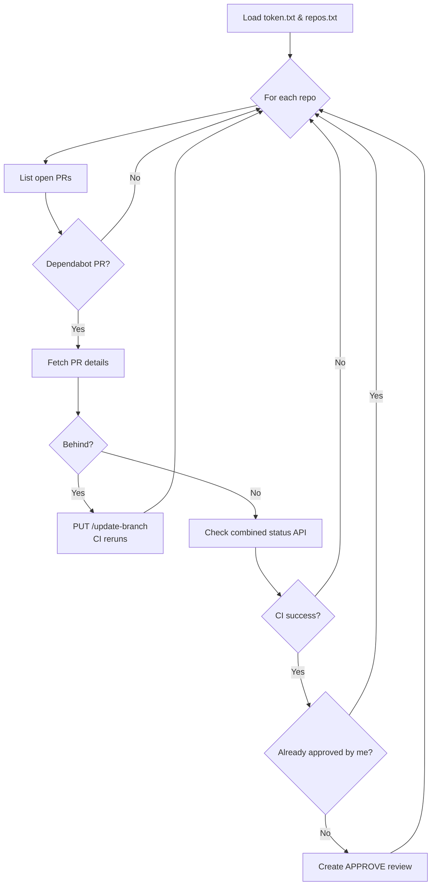

# GitHub Dependabot Approver

Automate a small—but time‑consuming—maintenance chore: **keeping Dependabot PRs up‑to‑date and approved as soon as CI is green.**

The script `approve-dependabot-prs.js` (ESM) does three things:

1. **Sync** – If a Dependabot pull‑request’s branch is _behind_ `main`/`master`, it triggers GitHub’s *Update branch* API so CI re‑runs on the latest code.
2. **Check** – When CI finishes, it looks at the commit **Statuses** (and, optionally, **Checks**) for the PR’s HEAD SHA and decides if everything passed.
3. **Approve** – If the PR is green *and* you haven’t approved it before, it adds an "Approve" review with **no comment body**.

---

## Why use it?

| Pain point | Script’s fix |
|------------|--------------|
| Stale Dependabot PRs waiting for a manual “Update branch” click. | Calls GitHub’s `update-branch` endpoint automatically. |
| Re‑approving the same PR every time CI reruns. | Skips if you already approved. |
| Forgetting to merge small, safe dependency bumps. | The PR is approved the moment CI is green; you can enable _auto‑merge_ on the repo if desired. |

---

## Prerequisites

* **Node.js 20 or later** (ESM support).
  `nvm install 20 && nvm use 20`
* A **GitHub Personal Access Token** with at least **`repo`** scope.
* Branch‑protection rule option **“Allow pull request branch to be updated automatically.”** (on by default).

---

## Installation

```bash
# 1 Clone or drop the two files into any folder
$ git clone <this‑repo> github‑approver
$ cd github‑approver

# 2 Install dependencies
$ npm install
```

---

## Configuration

1. **`token.txt`** – put your PAT on a single line:
   ```text
   ghp_xxx…
   ```
2. **`repos.txt`** – one `owner/repo` per line:
   ```text
   my‑org/backend
   my‑org/frontend
   ```
3. git update-index --assume-unchanged repos.txt token.txt

> **Tip** – you can symlink or copy these files from a safe location.

---

## Running

```bash
# Approve Dependabot PRs in all listed repos
npm run approve
```

`npm run approve` is defined in **package.json**:
```json
"scripts": {
  "approve": "node approve-dependabot-prs.js"
}
```

### Scheduling with **cron** on macOS

If you’d rather schedule the script with classic Unix *cron* instead of `launchd`, you can add a single line to your user crontab:

```bash
crontab -e
```

Append the following (runs **every Saturday at 09:00** local time):

```cron
0 9 * * Sat cd /Users/sergeyivanov/github_approver && /usr/local/bin/npm run approve >> approve.log 2>&1
```

| Field | Meaning |
|-------|---------|
| `0`   | minute 0 |
| `9`   | hour 09:00 |
| `* *` | any day‑of‑month, any month |
| `Sat` | Saturday |

**Why the `cd`?** It ensures the script finds `token.txt`, `repos.txt`, and writes logs in the repo directory.
`>> approve.log 2>&1` appends both stdout and stderr to `approve.log`.

Check, edit, or remove the entry with:

```bash
crontab -l   # list
crontab -e   # edit / delete
```

The script will now run automatically every Saturday, keeping Dependabot PRs synced and auto‑approved.

---

## How it works



---

## Duplicate‑approval prevention

Before approving, the script calls `pulls.listReviews` to see if **you** (the token owner) have already given an `APPROVED` review. If yes, it logs a message and skips.

---

## Customising

* **Merge after approval** – call `octokit.pulls.merge` right after the approval step.
* **Checks + Statuses hybrid** – in `isPullRequestGreen`, combine the two APIs if your repo uses both.
* **Different branch name** – nothing to change; `pr.base.ref` is detected automatically.
* **Logging** – replace `console.log` with your logger of choice.

---

## Limitations / Caveats

* If the branch has **merge conflicts** (`mergeable_state == "dirty"`), the script leaves it alone.
* It assumes CI sets **commit statuses**. If you rely only on GitHub Actions Checks, modify `isPullRequestGreen` accordingly.
* The PAT must have permission to **update branches** and **create reviews**.
